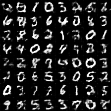
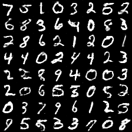
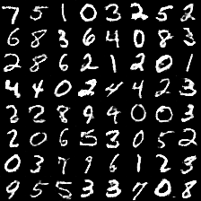
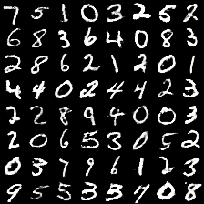

# DCGAN in TensorFlow

经典DCGAN项目中，是同时实现了GAN和CGAN的，但DCGAN的[tensorlayer版本]()只实现了GAN生成celebA人脸图像，对CGAN并没有实现。因此从该项目fork出来专门实现CGAN，并基于MNIST进行测试。

不得不说DCGAN源代码设计的优秀，即使用Tensorlayer实现，也并没有节约太多代码。

## 需求

- Python 2.7 or Python 3.3+
- [TensorFlow==1.0+](https://www.tensorflow.org/)
- [TensorLayer==1.4+](https://github.com/zsdonghao/tensorlayer)

## 使用

- 自备mnist数据集

- 直接训练模型

    $ python main.py

## 结果

最开始的采样到最后一个epoch的采样

 

 